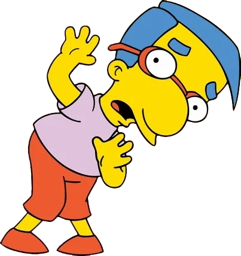
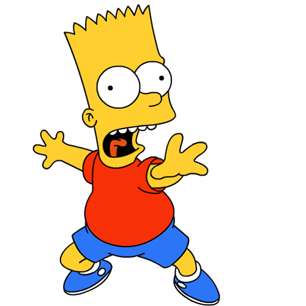
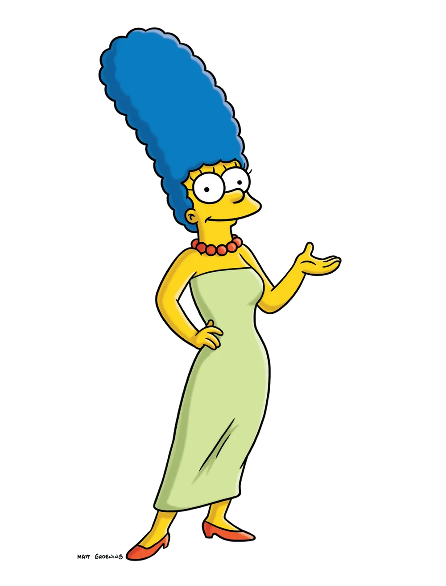

<h1 align="center">✨ 프론트엔드 프로젝트 ✨</h1>

  

---

<h2 align="center">🔥 팀 Ah Four 🔥</h2>

<h3 align="center">🍀 프로젝트명: <strong>QUEDOC</strong> 🍀</h3>

---

 

## 👪 팀원 소개

|      |      |   |    |        | 
| :--------------------------------------------------------: | :--------------------------------------------------------: | :--------------------------------------------------------: | :------------------------------------------------------: | :----------------------------------------------------------: | 
|  **서찬영** [@chan0o0](https://github.com/chan0o0seo) |  **박동휘** [@parkdonghwi-git](https://github.com/parkdonghwi-git) |  **김지원** [@J0a0J](https://github.com/J0a0J) |  **정지수** [@s00ya](https://github.com/s00ya) |  **김기성** [@saway126](https://github.com/saway126) | 

## 🎥 시연 영상
실제 페이지 시연 영상을 확인하세요!  
👀<a href= 'https://github.com/beyond-sw-camp/be12-2nd-ah_four-quedoc/wiki/%ED%94%84%EB%A1%A0%ED%8A%B8%EC%97%94%EB%93%9C-%EC%8B%9C%EC%97%B0%EC%98%81%EC%83%81'>프론트엔드 기능 시연</a>

---

## 🎨 Prototype
프로젝트 설계를 확인할 수 있습니다.  
🌈 <a href= 'https://www.figma.com/design/YpDRCaAzeEMd8AUxfkHWls/Quedoc-prototype?node-id=39-2&t=7szC74JCvJ0ffjx6-1'>피그마링크</a>

---

## 🌐 서버 배포
서비스에 접속해보세요!  
🏣 <a href='http://www.quedoc.kro.kr'> 큐닥</a>

---

  <strong>✨ 팀 Ah Four와 함께한 프로젝트 QUEDOC을 만나보세요! ✨</strong>

